# Olist Lakehouse — Walkthrough Guide

A guided tour of the project, phase by phase. The goal is to give someone with
moderate Databricks experience enough context to *follow along*, understand the
shape of each phase, and know where to look in the repo for the real code.

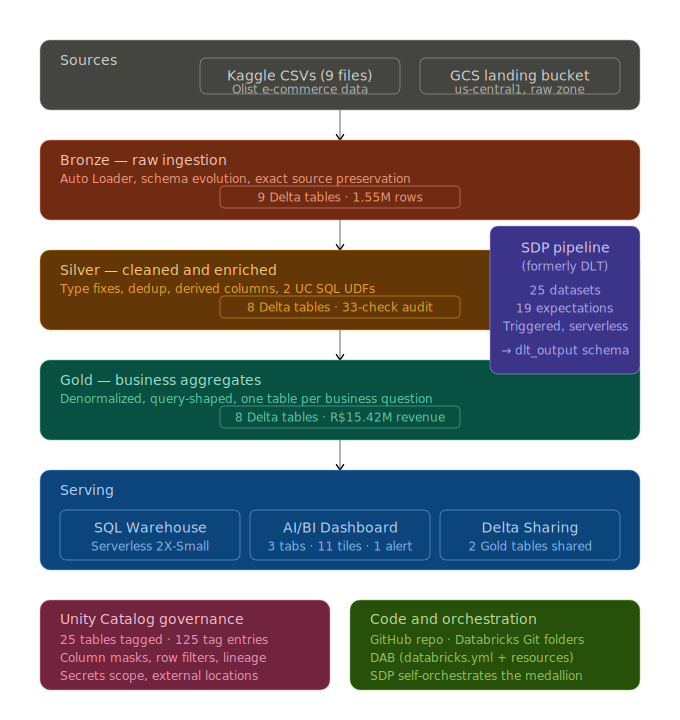

---

## How to use this guide

- Read top-to-bottom for the full story.
- Each phase has the same shape: **What you'll see → Key ideas → Walkthrough → Snippet → Where to look**.
- Code excerpts are illustrative — open the linked notebooks for full versions.

---

## Prerequisites

You should have these in place before Phase 0. The guide doesn't cover *how* to
provision them — pointers only.

| Need | Notes |
|---|---|
| **GCP project** with a GCS bucket | Used as the landing zone (`gs://<your-bucket>/landing/`). Must be in the same region as your Databricks workspace. |
| **Databricks workspace on GCP** with Unity Catalog enabled | Account-level metastore + at least one workspace attached. |
| **Kaggle account** | To download the [Olist dataset](https://www.kaggle.com/datasets/olistbr/brazilian-ecommerce). |
| **Databricks CLI v0.220+** | Needed for Phase 9 (Asset Bundles). `databricks --version` to check. |
| **`gcloud` / `gsutil`** | For uploading CSVs to GCS. |
| **A Databricks PAT or OAuth profile** | Configured as `~/.databrickscfg` so the bundle CLI can deploy. |
| **Permissions** | Workspace admin or, at minimum, `CREATE CATALOG` + `CREATE EXTERNAL LOCATION` on the metastore. |

> **Cost note:** Most phases run on Serverless SQL Warehouse + small all-purpose
> clusters. Phase 4 (SDP) spins up its own pipeline compute. Stop the warehouse
> when you're done.

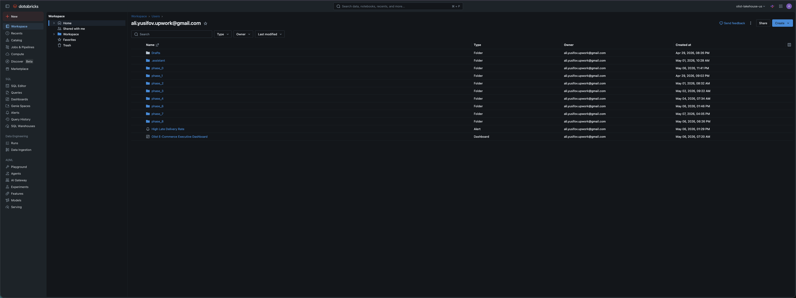

---

## Phase 0 — Setup: Catalog, Schemas, Volumes

**What you'll see:** A Unity Catalog catalog `olist_lakehouse_us` with four
schemas (`bronze`, `silver`, `gold`, `staging`) and an external location
pointing at your GCS landing bucket.

**Key ideas**

- **Three-level namespace** (`catalog.schema.table`) is the UC convention — every
  object in this project is addressed that way.
- **External location** is the UC object that authorizes Databricks to read your
  GCS bucket. The Auto Loader stream in Phase 1 reads through it.
- **Managed volume** stores the Auto Loader checkpoint + schema state.

**Walkthrough**

1. Upload Olist CSVs to GCS: `gsutil -m cp *.csv gs://<your-bucket>/landing/`.
2. Create a UC storage credential + external location pointing at that bucket
   (UI or SQL — see [data/README.md](data/README.md)).
3. Open [setup/phase_0_setup/00_catalog_Setup.sql](setup/phase_0_setup/00_catalog_Setup.sql)
   and run it — creates the catalog and the four schemas.
4. Run [setup/phase_0_setup/00_verify_setup.py](setup/phase_0_setup/00_verify_setup.py)
   to confirm everything is reachable.

**Snippet** — schema bootstrap:

```sql
USE CATALOG olist_lakehouse_us;

CREATE SCHEMA IF NOT EXISTS bronze
  COMMENT 'Raw ingested data from GCS - no transformations applied';
CREATE SCHEMA IF NOT EXISTS silver
  COMMENT 'Cleaned, validated, and enriched data';
CREATE SCHEMA IF NOT EXISTS gold
  COMMENT 'Business-ready aggregated tables for analytics';
```

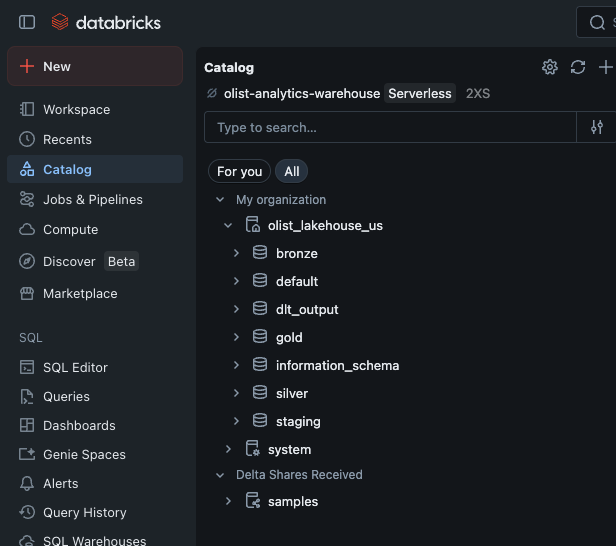

**Where to look:** [setup/phase_0_setup/](setup/phase_0_setup/)

---

## Phase 1 — Bronze: Ingestion with Auto Loader

**What you'll see:** Nine Bronze tables, one per CSV, populated incrementally
from GCS. Source-faithful — typos, dupes, and oddities are preserved.

**Key ideas**

- **Auto Loader** (`cloudFiles`) is the streaming-incremental file ingestor.
  Used here with `trigger(availableNow=True)` — start, drain, stop. No
  always-on cluster.
- **Schema location + checkpoint** live in a UC managed volume so state survives
  cluster restarts.
- **Lineage columns** (`_source_file`, `_file_modified_at`, `_ingested_at`) are
  added on every row — cheap audit trail.

**Walkthrough**

1. Run [01_bronze_setup.sql](notebooks/phase_1_bronze_ingestion/01_bronze_setup.sql)
   to create the checkpoint volume.
2. Open [01_bronze_ingestion.py](notebooks/phase_1_bronze_ingestion/01_bronze_ingestion.py).
3. Update `RAW_PATH` and `CATALOG` to your values.
4. Run all cells — each call to `ingest_to_bronze(...)` lands one source folder
   into one Delta table.

**Snippet** — the core Auto Loader call:

```python
reader = (
    spark.readStream
    .format("cloudFiles")
    .option("cloudFiles.format", "csv")
    .option("cloudFiles.schemaLocation", schema_location)
    .option("cloudFiles.schemaEvolutionMode", "addNewColumns")
    .option("header", "true")
)
df = reader.load(source_path).selectExpr(
    "*",
    "_metadata.file_path AS _source_file",
    "_metadata.file_modification_time AS _file_modified_at",
    "current_timestamp() AS _ingested_at",
)
```

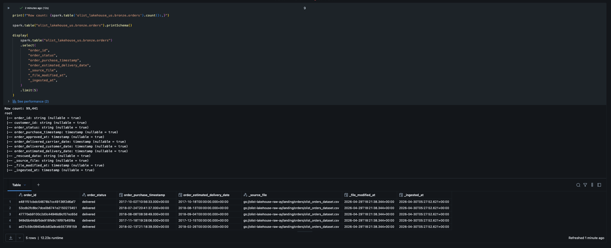

**Where to look:** [notebooks/phase_1_bronze_ingestion/](notebooks/phase_1_bronze_ingestion/)

---

## Phase 2 — Silver: Clean, Type, Enrich

**What you'll see:** Eight Silver tables (one per business entity), typed,
cleaned, with derived columns. A separate quality-checks notebook runs 33
assertions across them.

**Key ideas**

- **Silver contracts:** no null primary keys; honest types (e.g., naive Brazil
  timestamps stored as `TIMESTAMP_NTZ`); no duplicate PKs.
- **Derived business columns** belong here, not Gold — e.g., `delivery_days`,
  `is_late_delivery`, `delivery_delay_days` on `silver.orders`.
- **Three-valued booleans** preserve unknown state (delivered? late? — `NULL` if
  not delivered yet).

**Walkthrough**

1. Run the [silver UDFs notebook](notebooks/phase_2_silver_transforms/02_silver_udfs.py)
   first — it registers helpers used by the others.
2. Run the per-entity notebooks (`02_silver_orders.py`, `02_silver_customers.py`,
   …) in any order. Each is independent.
3. Finish with [02_silver_quality_checks.py](notebooks/phase_2_silver_transforms/02_silver_quality_checks.py)
   to verify contracts hold.

**Snippet** — the order-delivery derivations:

```sql
DATEDIFF(delivered_to_customer_ts, order_purchase_ts) AS delivery_days,
CASE
  WHEN delivered_to_customer_ts IS NULL THEN NULL
  WHEN delivered_to_customer_ts > estimated_delivery_ts THEN TRUE
  ELSE FALSE
END AS is_late_delivery
```

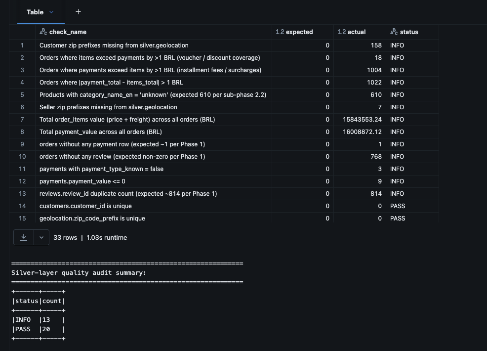

**Where to look:** [notebooks/phase_2_silver_transforms/](notebooks/phase_2_silver_transforms/)

---

## Phase 3 — Gold: Business-Ready Aggregates

**What you'll see:** Eight Gold tables, each answering a specific business
question — RFM segmentation, monthly revenue, delivery performance, geographic
flow, seller scorecards, etc.

**Key ideas**

- **One notebook per question.** Each Gold notebook is self-contained, so
  changes to one don't ripple through.
- **Grain matters.** RFM aggregates to `customer_unique_id` (person), not
  `customer_id` (per-order); revenue is `price + freight` over delivered orders.
- **Dataset cutoff for time-relative metrics.** Recency uses `MAX(order_purchase_ts)`
  not `CURRENT_DATE`, since the data is historical.

**Walkthrough**

1. Run the Gold notebooks in any order — they read from Silver, not from each other.
2. Run [03_gold_quality_checks.py](notebooks/phase_3_gold_analytics/03_gold_quality_checks.py)
   at the end.
3. The headline findings in the README come from these tables — re-run the
   queries inside each notebook to see them.

**Snippet** — RFM scoring (trimmed excerpt of the real CTE chain):

```sql
WITH reference_date AS (
  SELECT MAX(order_purchase_ts)::DATE AS ref_date
  FROM olist_lakehouse_us.silver.orders
  WHERE order_status = 'delivered'
),
customer_metrics AS (
  SELECT
    c.customer_unique_id,
    DATEDIFF(
      (SELECT ref_date FROM reference_date),
      MAX(o.order_purchase_ts)::DATE
    )                                  AS recency_days,
    COUNT(DISTINCT o.order_id)         AS frequency,
    ROUND(SUM(oi.total_item_value), 2) AS monetary
  FROM olist_lakehouse_us.silver.customers         c
  INNER JOIN olist_lakehouse_us.silver.orders      o  ON c.customer_id = o.customer_id
  INNER JOIN olist_lakehouse_us.silver.order_items oi ON o.order_id    = oi.order_id
  WHERE o.order_status = 'delivered'
  GROUP BY c.customer_unique_id
)
SELECT
  *,
  NTILE(5) OVER (ORDER BY recency_days DESC) AS r_score,  -- reverse: fewer days = higher R
  NTILE(5) OVER (ORDER BY frequency)         AS f_score,
  NTILE(5) OVER (ORDER BY monetary)          AS m_score,
  (frequency >= 2)                           AS is_repeat_customer
FROM customer_metrics;
```

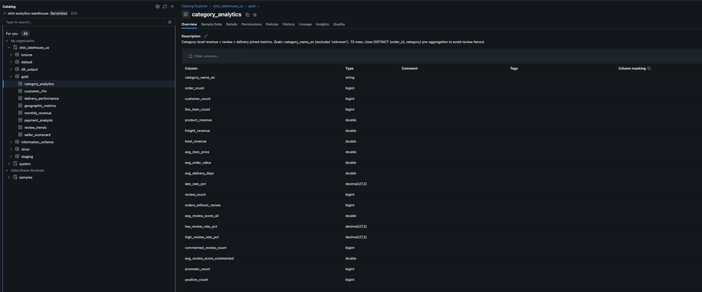

**Where to look:** [notebooks/phase_3_gold_analytics/](notebooks/phase_3_gold_analytics/)

---

## Phase 4 — Lakeflow Spark Declarative Pipelines (SDP)

**What you'll see:** The same medallion built **declaratively** — `@dp.table`
definitions that SDP wires into a DAG and runs as a managed pipeline. Outputs
land in `dlt_output` schema as `*_dlt` tables.

**Key ideas**

- **Imperative vs. declarative.** Phase 1–3 = `read → transform → write`,
  ordered by you. Phase 4 = describe the views, let SDP infer the dependency
  graph and ordering.
- **Equivalence is verifiable.** [04_comparison_notebook.py](pipelines/phase_4_dlt_pipelines/04_comparison_notebook.py)
  diffs every Phase 3 table against its Phase 4 twin.
- **One documented delta:** `gold_customer_rfm_dlt` has +112 rows because the
  SDP version filters orders to `delivered` upstream of RFM aggregation.

**Walkthrough**

1. Open [pipelines/phase_4_dlt_pipelines/pipelines/](pipelines/phase_4_dlt_pipelines/pipelines/)
   to see the four SDP source files (`sdp_01_bronze.py`, etc.).
2. Either run the pipeline via the Asset Bundle (Phase 9) or create a SDP
   pipeline manually in the UI pointing at this folder.
3. After the pipeline succeeds, open the comparison notebook and run it — every
   row-count check should pass except the documented RFM delta.

**Snippet** — a declarative table with expectations (excerpt from `sdp_02_silver_core.py`):

```python
from pyspark import pipelines as dp
from pyspark.sql.functions import col, datediff, when, expr

@dp.table(
    name="silver_orders_dlt",
    comment="Cleaned orders with delivery metrics. Streams from bronze_orders_dlt.",
    table_properties=SILVER_PROPS_TS,
)
@dp.expect_or_fail("valid_order_id",    "order_id IS NOT NULL")
@dp.expect_or_fail("valid_customer_id", "customer_id IS NOT NULL")
@dp.expect("delivery_days_non_negative", "delivery_days >= 0 OR delivery_days IS NULL")
def silver_orders_dlt():
    return (
        spark.readStream.table("bronze_orders_dlt")
        .select(
            col("order_id"),
            col("customer_id"),
            col("order_status"),
            col("order_purchase_timestamp").cast("timestamp_ntz").alias("order_purchase_ts"),
            col("order_delivered_customer_date").cast("timestamp_ntz").alias("delivered_to_customer_ts"),
            col("order_estimated_delivery_date").cast("timestamp_ntz").alias("estimated_delivery_ts"),
        )
        .withColumn("delivery_days",
            datediff(col("delivered_to_customer_ts"), col("order_purchase_ts")))
        .withColumn("is_late_delivery",
            when(col("delivered_to_customer_ts").isNull(), None)
            .when(col("delivered_to_customer_ts") > col("estimated_delivery_ts"), True)
            .otherwise(False))
    )
```

Three things worth noting in this snippet versus the imperative Phase 2 version:
- **Import is `from pyspark import pipelines as dp`** — SDP is now part of `pyspark`, no separate `dlt` package.
- **`@dp.expect_*` decorators** declare data-quality assertions inline. `expect_or_fail` halts the pipeline; `expect` warns; `expect_or_drop` drops bad rows.
- **`spark.readStream.table(...)`** reads upstream SDP tables — you reference them by name, SDP wires the dependency.

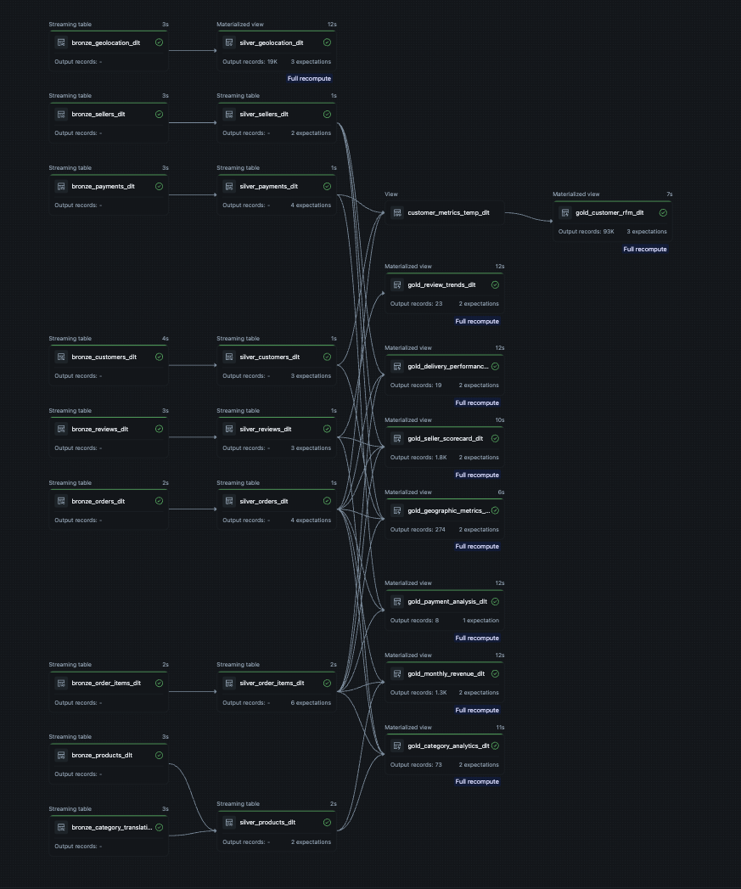

**Where to look:** [pipelines/phase_4_dlt_pipelines/](pipelines/phase_4_dlt_pipelines/)

---

## Phase 5 — SQL Warehouse, Dashboards, Alerts

**What you'll see:** Three AI/BI Dashboard tabs (Revenue, Delivery, Customers/Geography)
served from a Serverless SQL Warehouse over the Gold tables, plus one alert that
fires on high late-delivery rate.

**Key ideas**

- **Each visual = one SQL query** stored in
  [phase_5_sql_warehouse_dashboards_and_alerts/](notebooks/phase_5_sql_warehouse_dashboards_and_alerts/).
- **Serverless warehouse** — fast cold-start, scales to zero. Right call for
  dashboards that aren't used 24/7.
- **Alerts run on a schedule** against a query that returns a numeric column;
  threshold + comparator triggers a notification.

**Walkthrough**

1. Create a Serverless SQL Warehouse in the workspace.
2. Create a new AI/BI Dashboard, add three tabs, and paste each `tab*_*.sql`
   file as the visual's query.
3. Create an alert from [high_late_delivery_alert.sql](notebooks/phase_5_sql_warehouse_dashboards_and_alerts/high_late_delivery_alert.sql)
   — pick a threshold (e.g., `> 0.10`) and a destination.

**Snippet** — KPI tile query:

```sql
SELECT
  ROUND(SUM(total_revenue), 0)                    AS total_revenue_brl,
  SUM(order_count)                                AS total_orders,
  ROUND(SUM(total_revenue) / SUM(order_count), 2) AS avg_order_value_brl
FROM olist_lakehouse_us.gold.monthly_revenue;
```

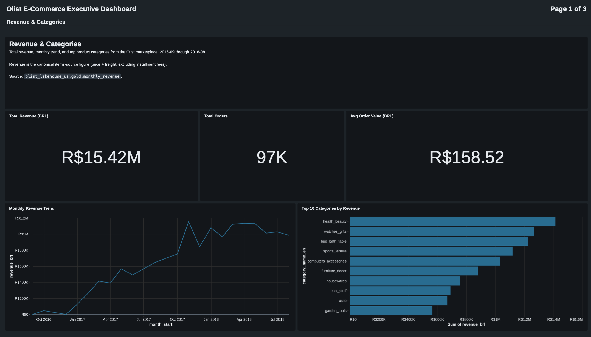
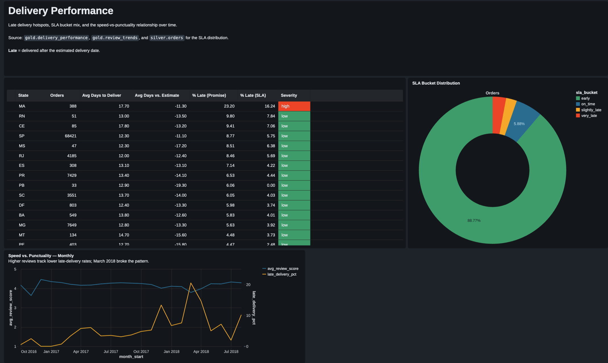
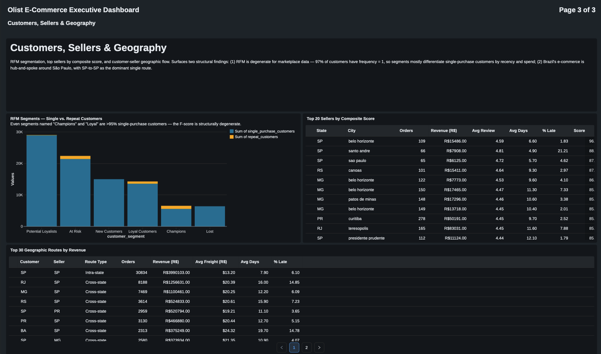

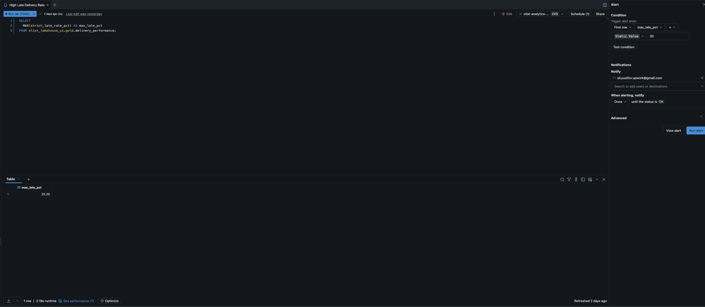

**Where to look:** [notebooks/phase_5_sql_warehouse_dashboards_and_alerts/](notebooks/phase_5_sql_warehouse_dashboards_and_alerts/)

---

## Phase 6 — Unity Catalog Governance

**What you'll see:** Tags on every table, comments on every table and key
columns, RBAC grants showing the access pattern, and an audit-log query.

**Key ideas**

- **Tags as a controlled vocabulary.** Five keys: `medallion_layer`, `domain`,
  `pii`, `refresh_frequency`, `data_classification`. Filterable in Catalog
  Explorer.
- **Comments are documentation that travels with the data** — visible in
  Catalog Explorer and queryable via `information_schema`.
- **Grants are illustrative.** Group names like `data_engineers` / `analysts`
  are documented as intent — they would already exist in a real org.

**Walkthrough**

Run each notebook in the folder once:

1. [06_governance_table_comments.py](notebooks/phase_6_governance/06_governance_table_comments.py)
2. [06_governance_column_comments.py](notebooks/phase_6_governance/06_governance_column_comments.py)
3. [06_governance_tags.py](notebooks/phase_6_governance/06_governance_tags.py)
4. [06_governance_access_control.py](notebooks/phase_6_governance/06_governance_access_control.py)
5. [06_governance_audit.py](notebooks/phase_6_governance/06_governance_audit.py)

**Snippet** — tag DDL is idempotent (`SET TAGS` upserts):

```sql
ALTER TABLE olist_lakehouse_us.bronze.orders SET TAGS (
  'medallion_layer'     = 'bronze',
  'domain'              = 'operations',
  'pii'                 = 'false',
  'refresh_frequency'   = 'daily',
  'data_classification' = 'internal'
);
```

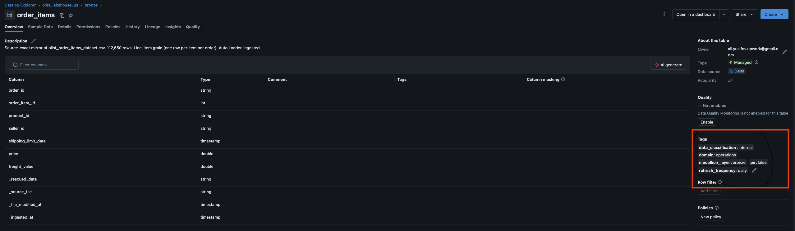

**Where to look:** [notebooks/phase_6_governance/](notebooks/phase_6_governance/)

---

## Phase 7 — Delta Sharing

**What you'll see:** A Delta Share (`olist_analytics_share`) bundling two Gold
tables, ready to expose to external consumers via the open-sharing protocol.

**Key ideas**

- **Shares are metastore-level securables**, sibling to catalogs — not nested
  inside one.
- **Open sharing** = token-based; the recipient gets a `config.share` profile
  file and can read with any Delta Sharing client (Python, Power BI, Tableau).
- **`SELECT` is the only privilege.** Sharing is read-only by design.
- **Recipient creation is documented but not executed** in this repo — adding
  the recipient produces a real activation token, which we don't want to ship
  in a public repo. The recipient half of the share is shown as commented
  reference SQL in [07_delta_sharing.py](notebooks/phase_7_delta_sharing/07_delta_sharing.py).

**Walkthrough**

1. Open [07_delta_sharing.py](notebooks/phase_7_delta_sharing/07_delta_sharing.py).
2. Run the first cell to create the share and add tables.
3. Read (don't run) the second cell to see how the recipient half would be
   wired up.

**Snippet** — creating the share:

```sql
CREATE SHARE IF NOT EXISTS olist_analytics_share
  COMMENT 'Olist gold-layer analytics tables shared with partner teams.';

ALTER SHARE olist_analytics_share ADD TABLE olist_lakehouse_us.gold.monthly_revenue;
ALTER SHARE olist_analytics_share ADD TABLE olist_lakehouse_us.gold.category_analytics;

SHOW ALL IN SHARE olist_analytics_share;
```

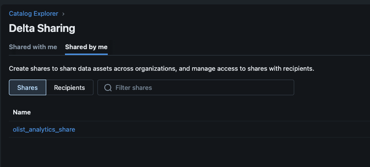

**Where to look:** [notebooks/phase_7_delta_sharing/](notebooks/phase_7_delta_sharing/)

---

## Phase 8 — Security Audit & Secret Scopes

**What you'll see:** A Databricks-backed secret scope (`olist-scope`) with one
demonstration secret, plus a pre-commit script that scans for credentials
before each git commit.

**Key ideas**

- **Secret scopes** are how Databricks injects credentials at runtime —
  `dbutils.secrets.get(scope, key)` retrieves; the value never appears in
  notebook output.
- **Scope creation needs the SDK or REST API.** `dbutils.secrets` only supports
  read operations.
- **Repository hygiene matters** as much as runtime secret handling. The
  [precommit_audit.sh](precommit_audit.sh) script catches PATs, workspace hosts,
  and bucket names before they're committed.

**Walkthrough**

1. Run [08_create_secret_scope.py](notebooks/phase_8_security_audit/08_create_secret_scope.py)
   in your workspace — creates the scope and adds a demo secret.
2. Read [08_pre_commit_audit.py](notebooks/phase_8_security_audit/08_pre_commit_audit.py)
   for the audit logic, then wire `precommit_audit.sh` into your local
   `.git/hooks/pre-commit`.
3. Skim [docs/audit_checklist.md](docs/audit_checklist.md) for the full list of
   patterns the audit catches.

**Snippet** — scope creation with the SDK (idempotent):

```python
from databricks.sdk import WorkspaceClient
from databricks.sdk.errors import ResourceAlreadyExists

w = WorkspaceClient()
try:
    w.secrets.create_scope(scope="olist-scope")
except ResourceAlreadyExists:
    pass  # re-runs are no-ops, not failures
```

**Where to look:** [notebooks/phase_8_security_audit/](notebooks/phase_8_security_audit/)
· [precommit_audit.sh](precommit_audit.sh) · [docs/audit_checklist.md](docs/audit_checklist.md)

---

## Phase 9 — Databricks Asset Bundles (IaC)

**What you'll see:** The schemas + the SDP pipeline expressed as YAML, deployed
through the Databricks CLI. Two targets: `dev` (per-user prefix, schedules
paused) and `prod` (shared path, stricter checks).

**Key ideas**

- **Asset Bundles = IaC for Databricks resources** — pipelines, jobs, schemas,
  permissions, all expressed in YAML.
- **Targets isolate environments.** `mode: development` prefixes everything
  with `[dev <user>]` so a dev deploy can never trigger a prod pipeline.
- **No tokens in YAML.** Auth resolves via `~/.databrickscfg` profile or env
  vars; the workspace host comes in as a `--var`.

**Walkthrough**

1. From the repo root: `databricks bundle validate --target dev --var databricks_host=https://<your-host>`.
2. `databricks bundle deploy --target dev` — creates the schemas + pipeline
   under your user prefix.
3. `databricks bundle run olist_medallion_pipeline --target dev` — kicks off
   the SDP run.
4. Inspect the generated resources in the Workspace UI — note the `[dev <username>]`
   prefix.

**Snippet** — target definitions from [databricks.yml](databricks.yml):

```yaml
targets:
  dev:
    mode: development
    default: true
    workspace:
      root_path: /Workspace/Users/${workspace.current_user.userName}/.bundle/${bundle.name}/${bundle.target}
  prod:
    mode: production
    workspace:
      root_path: /Shared/.bundle/prod/${bundle.name}
    permissions:
      - level: CAN_MANAGE
        group_name: data_engineers
      - level: CAN_VIEW
        group_name: analysts
```

**Where to look:** [databricks.yml](databricks.yml) · [resources/](resources/) · [bundle/README.md](bundle/README.md)

---

## What to read next

- **Quickstart commands:** [README.md](README.md#quickstart)
- **Dataset bootstrap:** [data/README.md](data/README.md)
- **Bundle deep-dive:** [bundle/README.md](bundle/README.md)
- **Audit pattern catalog:** [docs/audit_checklist.md](docs/audit_checklist.md)

---

*Found a rough edge in this guide? It probably means a phase grew. PRs welcome.*
